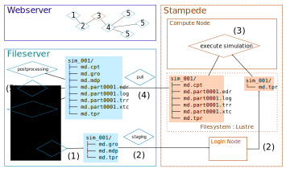
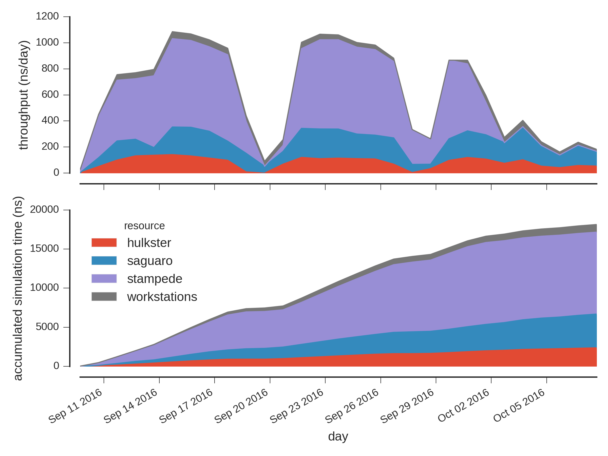
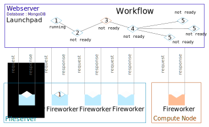
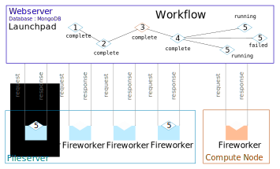
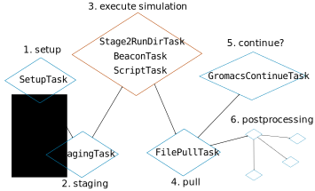

# Talk Narrative

## The problem we are trying to solve

At any given time we may have access to multiple disparate compute resources, and many (possibly hundreds) of simulations to execute.
How can we optimally make use of all these resources to perform all this work without driving ourselves (or our students and postdocs) to jump out of a window?

We present an automation solution that has some attractive features:

1. The work of executing simulations is expressed as a *workflow*: a set of discrete tasks with dependencies between them.
   The work we need to do fits this model pretty well.
2. Each task of the workflow can be executed on a different machine in a different context.
   Tasks that are running simulation code can happen on supercomputer nodes, while analysis tasks can happen on workstations, for example.
3. The system is tolerant to task failures, which *will* happen.
   The tasks for running MD can be written so they are re-runnable with no issue.


This solution has some challenges for deployment we would like to improve upon:

1. It requires deployment of a MongoDB instance for storing the workflows themselves.
2. Requires setup of execution environments on each machine that must execute tasks.
   This must often be done taking into account the details of each machine.
3. Requires an understanding of how the system works, and how communication must occur between components, in order to debug persistent failures.
   This talk seeks to provide that understanding at a high level for getting started.

## A typical molecular dynamics workflow



A typical molecular dynamics workflow probably consists of at least the following, at least when running a single, independent simulation (e.g. not replica exchange).

1. We first set up the system, perhaps on our own fileserver or workstation.
2. We would then push the files required for execution of our simulation to a remote cluster such as Stampede.
   Typically done via SFTP or SCP, or some variant.
3. We'd submit a script to the queueing system on the cluster for executing the simulation, and at some point that simulation would execute on a compute node.
4. When the simulation job has finished, we might pull the resulting data files from the cluster using our fileserver.
5. We could then run any number of postprocessing or analysis tasks.
   We might also decide whether or not to continue the simulation, which would mean we start a new set of tasks beginning with one like (2).

This set of tasks could be expressed as a *workflow*, which happens to be a *directed, acyclic graph* ("DAG") giving nodes as tasks and arrows for dependencies.
This can be thought of as a flowchart of the work we need to perform.
It turns out that the system of automation we are presenting can perform exactly the tasks laid out in this way, as each task is:
1. Discretely defined. Each task is either waiting on dependencies, ready, running, complete, or failed.
   Because the state of a task is one of these discrete values, it is clearly defined when we can execute a task that is dependent on another.
2. *Idempotent*, meaning that if we were in the middle of a task and it failed for some reason, we could just do that task again and we'd be fine.
   There would be no side effects to re-running a task, save for some resource cost (CPU hours, bandwidth).
   This affords a great deal of fault tolerance, which becomes important with the scale of work we are executing.

We can store this workflow in a central place accessible to all machines that need to see it, such as a webserver.
This system can execute hundreds of these workflows, perhaps each running very different simulations, at the same time, using the same infrastructure.
This is powerful, and can win us some immense throughput.

As an illustration of this throughput, here is the throughput a system like this delivered in late summer 2016.
We used four compute clusters, performing nearly 400 simulations of the membrane protein NapA to compute an alchemical binding pathway for free energy calculation.
Each simulation numbered over 130,000 atoms, and over 15 days we collected over 13 microseconds of trajectory data.
These simulations were executed in short (~4 hour) segments, nearly 20,000 segments in total.
We consumed 1.1 million CPU hours in this time.



## Fireworks: a general-purpose workflow automation system

The system we have described so far is [`fireworks`](https://github.com/materialsproject/fireworks), a workflow automation framework written entirely in Python.
This was not developed by us, but is an open source project born out of *The Materials Project*, a large-scale effort to obtain computed information on known and predicted materials.
This is not the first workflow automation system that uses DAGs for expression of work, and it won't be the last, but it is effective for our needs.

Fireworks includes the following data elements, with fun names to make them easier to talk about:
1. *Workflow*: a DAG, with tasks as nodes and dependencies expressed as vectors between them.
2. *FireWork*: a single node/task in a *Workflow*, with discrete state (waiting, ready, running, complete, failed).
3. *Firetask*: a subtask of a *FireWork*. These are run in sequence within a *FireWork*, and all must succeed for the *FireWork* to succeed.

These data elements are handled by the following infrastructure components:
1. A *Launchpad*, where the Workflows we construct are stored along with the execution states of their tasks.
   This is a MongoDB database.
2. *Fireworkers*: processes launched on other machines to execute work.
   These processes reach out across the network, often the internet, to query the *Launchpad*.
   They will grab the next available "ready" *FireWork*, set its state to "running", and execute it.
   If it fails to complete, it will set the state to "failed"; if it succeeds it will set it to "complete".
   These processes must be able to reach the *Launchpad* to work.


### A play-by-play of workflow execution

To illustrate these components all interacting, we'll return to our example of executing MD on a remote cluster.


#### Execution basics

Fireworkers running on the fileserver and compute nodes query the Launchpad for available work.
For a Workflow that is yet to see execution, FireWorks with no upstream dependencies are in a "ready" state, while those with upstream dependencies are "not ready".


FireWorks that are "ready" can be executed by a requesting Fireworker; when executing, the FireWork is in a "running" state:



During this time, other Fireworkers may be constantly requesting work from the Launchpad.
Because no FireWorks are in the "ready" state, they will get nothing to do.
It should be noted, however, that when many workflows such as this are avialble to execute in the Launchpad, there is usually more work available to do.

When a Fireworker completes its work without issue, it changes the state of its FireWork to "complete".
Any FireWorks whose upstream dependencies are all "complete" are set to "ready".


The process continues, with "ready" Fireworks consumed and executed by Fireworkers.


Since Fireworkers are all independent processes, unaware of each other, it is pretty random which of these workers the FireWork will execute on.
Fireworker processes should be started up on machines with this in mind.


#### Directing FireWorks to specific FireWorkers using categories

However, it is possible to assign a [category](https://materialsproject.github.io/fireworks/controlworker.html#method-2-using-categories) to FireWorks so that they will only run on a Fireworker with a matching category.
In our example, we actually have two categories of FireWorks: `blue` and `orange`.
`blue` Fireworkers will only execute `blue` FireWorks; `orange` Fireworkers will only execute `orange `FireWorks.
This is important for this workflow since we want some tasks to run on our fileserver, and only the simulation task (3) to run on a cluster compute node.


#### Dealing with failure

What happens if the simulation fails, perhaps due to a filesystem issue on the remote cluster?
If the Fireworker raises on exception while executing the FireWork, it will tell the Launchpad to mark the FireWork as failed.


This situation requires manual intervention from the user to change the state of the FireWork from "failed" to "ready".
Individual FireWorks can fail for a variety of reasons, but these can usually be categorized as *systematic* or *random* failures.
A *systematic* failure occurs when the assumptions of a FireWork's underlying code are no longer valid, and if re-run, it will fail again in the same way.
A *random* failure is one due to some transient change of conditions, such as a filesystem failure, that may not show itself again if the FireWork is re-run.

Before setting a "failed" FireWork to "ready", the user should always examine the Fireworker logs to characterize the issue.
This is the cost of automation such as this; though the system can spare one the tedium of manual execution, it still requires manual intervention *some* of the time.

Perhaps we chalk this failure up to *random*, and try a re-run.
It executes and completes without issue, probably on a different node of the cluster as part of a different compute job, run at a later time.


### Parallelism for free(!)

Upon completion of FireWork (4), all of the FireWorks marked (5) will be changed to the "ready" state.


This means that any available Fireworker with a matching category can execute each of these tasks, and since we have plenty of Fireworker processes asking for work, they will likely be executed at the same time.


It's important to remember that the Fireworker processes have no awareness of each other, and have no awareness of what else is being executed.
If we want a FireWork to *always* execute before another FireWork, there *must* be an explicit dependency link between them encoding this.
FireWorks with no dependency links, such as those marked (5), may execute in any order by any corresponding Fireworker.

Because these tasks are independent, they can also fail independently.



As discussed previously, failures require manual investigation and intervention to proceed.
If we're confident we've fixed the underlying issue, we can mark the "failed" FireWork as "ready" again:


#### Victory

When all FireWorks of a Workflow are complete, the whole Workflow is considered completed.


## Building workflows in Python

Fireworks is written in Python, a programming language that enjoys immense popularity and wide appeal across many disciplines.
This is an advantage, as this makes it possible to use a vast array of tools for writing individual tasks in our workflows, as well as for building the workflows themselves.
To illustrate this, we'll continue to use our MD workflow as an example.

### Building workflows programmatically

Our MD workflow can be built programmatically, directly in Python.
Although Fireworks allows workflows to be defined in a declarative-style YAML format as well, using Python allows for easier automation of workflow creation, which is especially necessary when running hundreds of simulations with differing parameter choices.
It also allows us to do some advanced things if needed, such as grafting two workflows together.

Below is an example of a function we could write that would generate a workflow from a few pieces of information.


```python
def make_md_workflow(simdir, params, uuid, stages, files, postrun_wf=None):
    """Generate a workflow for MD execution.

    Parameters
    ----------
    simdir : path-like
        Simulation directory.
    params : dict
        Dictionary of parameters for simulation setup.
    uuid : str
        Unique identifier for this simulation.
    stages : path-like
        Path to a yaml file giving a list of dictionaries with the following keys:
            - 'server': server host to transfer to
            - 'user': username to authenticate with
            - 'staging': absolute path to staging area on remote resource
    files : list
        Names of files (not paths) needed for each leg of simulation.
    postrun_wf : Workflow
        Workflow to perform after each copyback; performed in parallel to continuation run.

    """

    ## 1. SETUP
    ft_setup = SetupTask(dir=simdir,
                         params=params)

    fw_setup = Firework([ft_setup],
                        spec={'_launch_dir': simdir,
                              '_category': 'local'},
                        name='setup')
    
    ## 2. STAGING
    ft_stage = StagingTask(stages=stages,
                           files=files,
                           archive=simdir,
                           uuid=uuid,
                           shell_interpret=True,
                           max_retry=5,
                           allow_missing=True)

    fw_stage = Firework([ft_stage],
                        spec={'_launch_dir': archive,
                              '_category': 'local'},
                        name='staging',
                        parents=fw_setup)

    ## 3. MD EXECUTION
    # copy input files to scratch space
    ft_copy = Stage2RunDirTask(uuid=uuid)

    # send info on where files live to pull firework
    ft_info = BeaconTask(uuid=uuid)

    # next, run MD
    ft_md = ScriptTask(script='run_md.sh {}'.format(
                            os.path.join('${SCRATCHDIR}/', uuid)),
                       use_shell=True,
                       fizzle_bad_rc=True)

    fw_md = Firework([ft_copy, ft_info, ft_md],
                     spec={'_category': 'md'},
                     name='md',
                     parents=fw_stage)

 
    ## 4. PULL
    ft_copyback = FilePullTask(dest=archive)

    fw_copyback = Firework([ft_copyback],
                           spec={'_launch_dir': archive,
                                 '_category': 'local'},
                           name='pull',
                           parents=fw_md)

    ## 5. CONTINUE?
    if md_engine == 'gromacs':
        ft_continue = GromacsContinueTask(sim=simdir, archive=archive,
                stages=stages, files=files, md_engine=md_engine,
                md_category='md', local_category='local',
                postrun_wf=postrun_wf, post_wf=post_wf)
    else:
        raise ValueError("No known md engine `{}`.".format(md_engine))

    fw_continue = Firework([ft_continue],
                           spec={'_launch_dir': archive,
                                 '_category': 'local'},
                           name='continue',
                           parents=fw_cleanup)

    # BUILD WORKFLOW
    wf = Workflow([fw_stage, fw_md, fw_copyback, fw_cleanup, fw_continue],
                  name=uuid)

    ## 6. POSTPROCESSING
    if postrun_wf:
        if isinstance(postrun_wf, dict):
            postrun_wf = Workflow.from_dict(postrun_wf)

        wf.append_wf(Workflow.from_wflow(postrun_wf), [fw_copyback.fw_id])
        
    return wf
```

This function can generate our workflow, with individual *Firetasks* shown within each *FireWork*.



We've modified the tail of our workflow from previously.
The "continue?" *FireWork* now sits alongside a **chain** of postprocessing *FireWorks*, since these are grafted on at the end as a separate workflow given as a keyword argument to our function.
This is to illustrate that we can create custom workflows for postprocessing and graft them onto our execution workflow so these tasks are performed as each MD trajectory segment is computed.


### Writing Firetasks

*FireTasks* are the actual working units of a *FireWork*.
They are often


### Self-modifying workflows


[`mdworks`](https://github.com/Becksteinlab/mdworks) gives an example for how to do this.


## Things we didn't talk about in detail

1. Submitting Fireworkers to a queueing system.
   See the Fireworks docs for how to do do this, and how to make effective use of `qlauncher`s.
